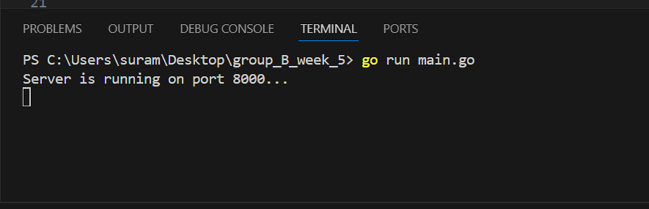

# Implementation of Movies CRUD API

This is a RESTful API for managing a movie database. It provides endpoints for creating, retrieving, updating, and deleting movie entries.

## Server running on port 8000

## Features

This API will perform the following tasks:
1. Create new movies
2. Get all movies
3. Get movies by ID
4. Update an existing movie
5. Delete a movie

### 1. Create a New Movie
The API allows you to create a movie by passing the following parameters:
- **title**: The title of the movie
- **director**: The director of the movie
- **release_year**: The year the movie was released
- **genre**: The genre of the movie

### 2. Get All Movies
The API provides a list of all movies in the database.

### 3. Get Movie by ID
This API allows you to retrieve a movie by its unique ID.

### 4. Update the Movie by ID
This API allows you to update an existing movie by its ID. You can modify the title, director, release year, and genre.

### 5. Delete a Movie by ID
This API allows you to delete a movie based on its ID.

